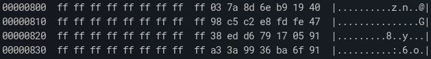
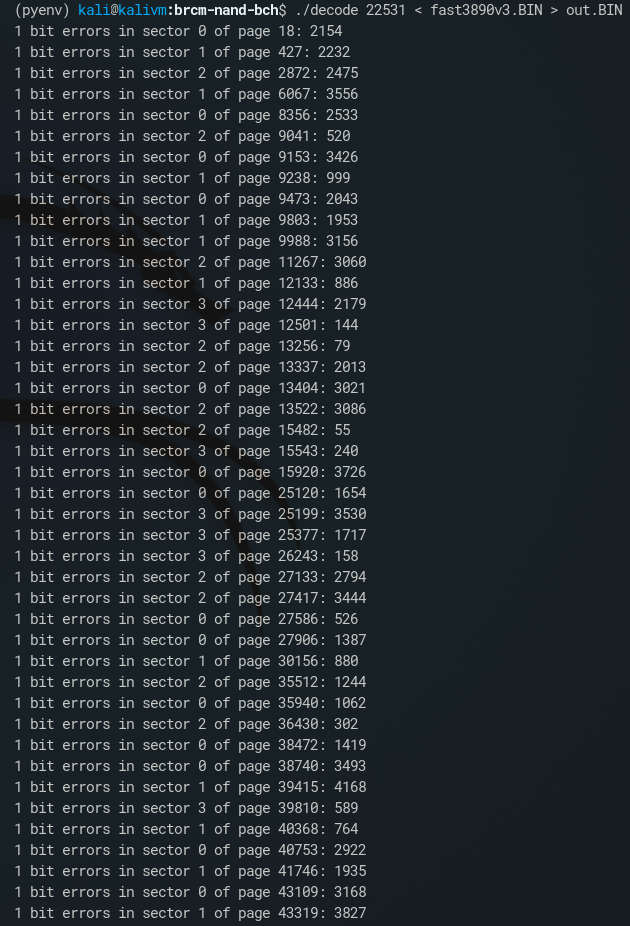

A page in the NAND flash consists of 2048 bytes of data and 64 bytes of spare area/OOB data.  
The spare area consists of four 16-byte areas that correspond to 512-byte sectors in the 2048-byte page.  
Each area has 9 bytes of 'FF' and 7 bytes of ECC data.  
The image below shows an example spare area from the first page of the dumped image:  
  
Broadcom's ECC algorithm is described here:  
https://github.com/ak-hard/brcm-nand-bch  
And furthermore can be calculated using this tool:  
https://github.com/StrayLightning/brcm-nand-bch  
Correct params for the BCH are:    
m = 14  
t = 4  
prim_poly = 0x5803 = 22531  

In the image below the calculated ECC for each sector is printed out.  
  
The stored ECC (first image) matches the calculated ECC (second image) which confirms the validity of the BCH params. We can now run decode for the dumped image:  
  

