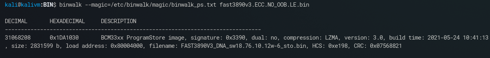

Running `binwalk3 -a -e fast3890v3.ECC.bin` results in two extracted Linux filesystems from December 2020 and May 2021 as well as other data, such as DTBs.

Using binwalk with a custom magic file for the Broadcom ProgramStore format:  
  

